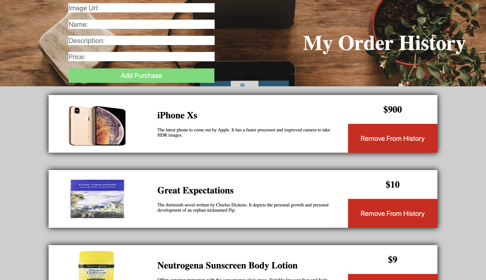

## Order History UI

This application was built with `create-react-app`.

### Set Up

Clone down this repo.

On GitHub, create a new, empty repository and name it something like 'order-history-fe'.

Update the current remote origin and point it at the new URL of the repository you just created on GitHub. You can read how to do this [here](https://help.github.com/en/articles/changing-a-remotes-url).

Once you've updated the remote, you should run `npm install`, commit, and then push your initial commit to your updated remote origin. You might need to use the `-u` flag when you push (like this: `git push -u origin master`).

Run `npm start` to start up your React server.

### Expectations / Rules

Build a React App that displays your order history!

You will have 3 hours to build out this application.

We do want to see good commit habits - atomic commits that log small, focused changesets. Don't worry about creating GitHub issues, though.

### Iteration 0

Pull down the [API repo](https://github.com/turingschool-examples/order-history-api). Set up instructions are in the repository's README.

### Iteration 1

Get all existing purchases on page load and display them on the DOM.

### Iteration 2

Create a controlled form component to create a new purchase (look into the API documentation to see what pieces of information are expected, and what datatypes it wants each piece to be).  When the user clicks the `Add Purchase` button, the application should update the App's state.  The new purchase should display with all of the existing purchases.

### Iteration 3

Now that the functionality is there, write some tests.  Focus on tests for the UI as well as state changes and simulating events.  For now, you don't have to test everything.  But write two tests for each (6 total).

### Iteration 4

When the user makes a new purchase, the application should make a post request to the API.  The new purchase should still exist upon reloading the page.

**You may not have any fetch calls in any component other than App!**

(If you have time to refactor your fetch calls into a separate helper file, that is fine, but it is *NOT* a requirement for this application.)

### Iteration 5

Delete a purchase when the user clicks the `Remove From History` button.  The deletion should persist upon reloading the page.

### Extensions

* Now try testing your API calls.  Try writing out a few tests including happy path and sad path testing.

* Add a button or drop down so that the user has the option to sort their past purchases by price from least to greatest or greatest to least.
